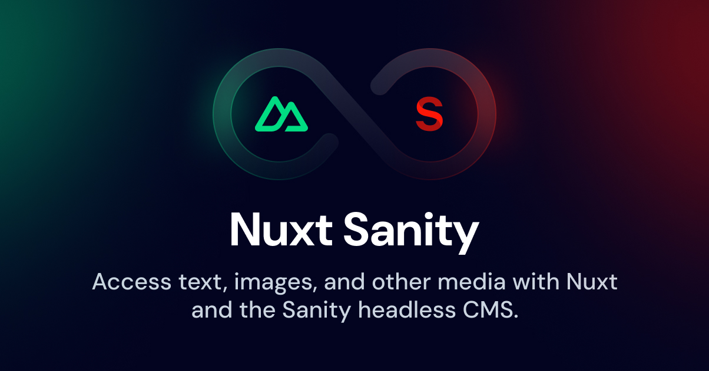

[](https://sanity.nuxtjs.org)

# Nuxt Sanity

[![npm version][npm-version-src]][npm-version-href]
[![npm downloads][npm-downloads-src]][npm-downloads-href]
[![Github Actions CI][github-actions-ci-src]][github-actions-ci-href]
[![Codecov][codecov-src]][codecov-href]
[![License][license-src]][license-href]

> [Sanity](https://sanity.io/) integration for [Nuxt](https://nuxtjs.org)

- [✨ &nbsp;Release Notes](https://sanity.nuxtjs.org/releases)
- [📖 &nbsp;Documentation](https://sanity.nuxtjs.org)

## Features

- Just bring your sanity.json - no additional configuration required
- Ultra-lightweight Sanity client
- Zero-config image/file components + portable text renderer
- Supports GROQ syntax highlighting
- Nuxt 3 and Nuxt Bridge support

[📖 &nbsp;Read more](https://sanity.nuxtjs.org)

## Quick setup

1. Add `@nuxtjs/sanity` dependency to your project

```bash
yarn add @nuxtjs/sanity # or npm install @nuxtjs/sanity
```

2. Add `@nuxtjs/sanity` to the `modules` section of `nuxt.config.ts`

```js
{
  modules: [
    '@nuxtjs/sanity',
  ],
  sanity: {
    // module options
  }
}
```

**Note**: For Nuxt 2 support without Bridge, install `@nuxtjs/sanity@0.10.0` and follow the instructions at https://v0.sanity.nuxtjs.org.

## Development

1. Clone this repository
2. Install dependencies using `pnpm install`
3. Stub module with `pnpm dev:prepare`
3. Start development server using `pnpm dev`

## License

[MIT License](./LICENSE)

<!-- Badges -->

[npm-version-src]: https://img.shields.io/npm/v/@nuxtjs/sanity/latest.svg
[npm-version-href]: https://npmjs.com/package/@nuxtjs/sanity
[npm-downloads-src]: https://img.shields.io/npm/dm/@nuxtjs/sanity.svg
[npm-downloads-href]: https://npmjs.com/package/@nuxtjs/sanity
[github-actions-ci-src]: https://github.com/nuxt-modules/sanity/workflows/ci/badge.svg
[github-actions-ci-href]: https://github.com/nuxt-modules/sanity/actions?query=workflow%3Aci
[codecov-src]: https://img.shields.io/codecov/c/github/nuxt-modules/sanity.svg
[codecov-href]: https://codecov.io/gh/nuxt-modules/sanity
[license-src]: https://img.shields.io/npm/l/@nuxtjs/sanity.svg
[license-href]: https://npmjs.com/package/@nuxtjs/sanity
